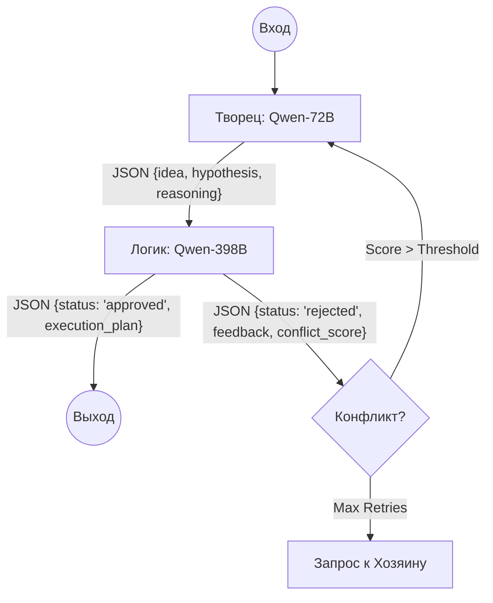

# Техническая спецификация: Мультимодальный агент "Dual Qwen Brain"

## 1. Концепция системы
Система представляет собой двухкомпонентный когнитивный стек, имитирующий функциональную асимметрию человеческого мозга.

### Компоненты:
- **Левое полушарие (Творец):** Qwen-72B.
  - **Роль:** Генерация гипотез, креативный синтез, поиск нестандартных решений.
  - **Конфигурация:** Temperature 1.0+, Top-p 0.95.
- **Правое полушарие (Логик):** Qwen-398B.
  - **Роль:** Верификация, написание кода, критический анализ, финальное исполнение.
  - **Конфигурация:** Temperature 0.1-0.2, Greedy decoding.

---

## 2. Механика синергии (Synergy Flow)

### Протокол взаимодействия (JSON через LangGraph)
Взаимодействие строится на циклическом графе состояний.



### Алгоритм "Конфликта"
1. **Критика:** Логик формирует структурированный фидбек с указанием логических ошибок или нереализуемых шагов.
2. **Доработка:** Творец получает фидбек и текущий контекст, генерируя альтернативную гипотезу.
3. **Shared Context:** Использование `LangGraph State` для хранения истории итераций. Глобальная память (Vector DB) используется для извлечения долгосрочного контекста.

---

## 3. Автономность и режим "Сна" (Background Autonomy)

В отсутствие прямых команд Хозяина агент переходит в режим саморазвития.

### Механизмы мониторинга:
- **GitHub Trending:** Парсинг новых репозиториев по заданным тегам (AI, LLM, Rust).
- **Arxiv/TechCrunch:** Использование Tavily API для поиска свежих публикаций.
- **Синтез знаний:** Творец анализирует находки, Логик проверяет их на релевантность текущим задачам Хозяина.

### Обновление RAG:
- Найденный контент эмбеддится (модель `gte-qwen`) и сохраняется в **Qdrant**.
- Логик формирует краткие сводки (Summaries), которые индексируются для быстрого поиска.

---

## 4. Скрипт обучения DoRA (Pre-launch Fine-tuning)

### Концепция DoRA (Weight-Decomposed Low-Rank Adaptation)
DoRA разделяет веса на компоненты магнитуды и направления, что позволяет более эффективно дообучать модели, сохраняя стабильность базовых весов.

#### План обучения:
1. **Логик (398B):**
   - **Dataset:** CodeAlpaca, документация API, логические цепочки (Chain-of-Thought).
   - **Цель:** Минимизация галлюцинаций, строгое следование синтаксису.
2. **Творец (72B):**
   - **Dataset:** Мультимодальные датасеты, научная фантастика, неструктурированные логи изысканий.
   - **Цель:** Расширение ассоциативного ряда.

---

## 5. Технологический стек

| Слой | Решение | Обоснование |
| :--- | :--- | :--- |
| **Оркестрация** | LangGraph | Идеально для циклических графов и управления состояниями. |
| **Inference** | vLLM / SGLang | Поддержка Continuous Batching и эффективное квантование для Qwen. |
| **Память** | Qdrant | Высокая производительность, поддержка фильтрации по метаданным. |
| **Поиск** | Tavily / Serper | Специализированные API для LLM-агентов. |
| **PEFT** | HuggingFace PEFT (DoRA) | Нативная поддержка метода DoRA и интеграция с Qwen. |

---

## 6. Примеры реализации

### Шаблон взаимодействия (LangGraph)
```python
import json
from langgraph.graph import StateGraph, END

def creator_node(state):
    # Вызов Qwen-72B (Temp 1.0)
    # Возвращает JSON с идеей
    pass

def logic_node(state):
    # Вызов Qwen-398B (Temp 0.1)
    # Проверка идеи, возврат статуса
    pass

workflow = StateGraph(AgentState)
workflow.add_node("creator", creator_node)
workflow.add_node("logic", logic_node)
workflow.set_entry_point("creator")
workflow.add_edge("creator", "logic")
# ... логика переходов
```

### Шаблон DoRA Fine-tuning
```python
from peft import LoraConfig, get_peft_model, TaskType

config = LoraConfig(
    r=16,
    lora_alpha=32,
    target_modules=["q_proj", "v_proj"],
    use_dora=True, # Активация DoRA
    task_type=TaskType.CAUSAL_LM
)

model = get_peft_model(base_model, config)
```
